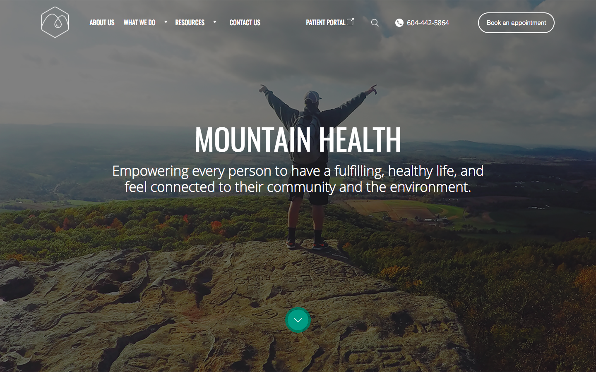

# Mountain Health Team

 <h3>created by: </h3>
 <ul>
 <li>Aleksandr Altshteyn</li>
 <li>Hanin Mustafa</li>
 <li>Kadyn Neale</li>
 </ul>

 <h2>What it is</h2>

For the final project at Red Academy we built real world live website for community client. It was designed by the UX students at Red Academy. A mobile first responsive Wordpress CMS website was created by the web development group(McKenzie Eggers, Michael Lelli, Lily Yang, Alban Carmet). 

Mountain Health Team is a website created for client Amanda Chey. Its purpose to premote her clinic and provide information on
naturopathy.

The website was created using a mobile first approach, meaning that the mobile version of the website is designed first, and then additional CSS is written to create a desktop version when the screen size increases.
 
The backend of the website was setup so that the client can access and make changes to the website without coding knowledge. 

<h2>What it uses</h2>

Mountain Health Team's website uses many different things to achive its goal, including....

<ul>
    <li>HTML</li>
    <li>SASS/CSS</li>
    <li>Javascript</li>
    <li>Jquery</li>
    <li>Gulp</li>
    <li>PHP</li>
    <li>Wordpress</li>
</ul>
